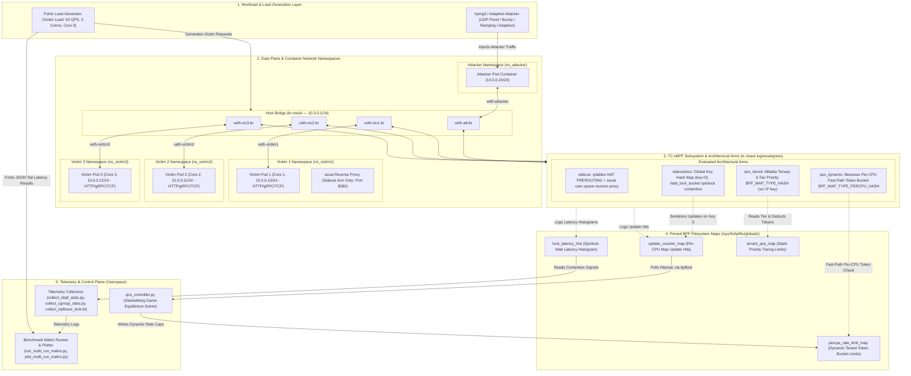
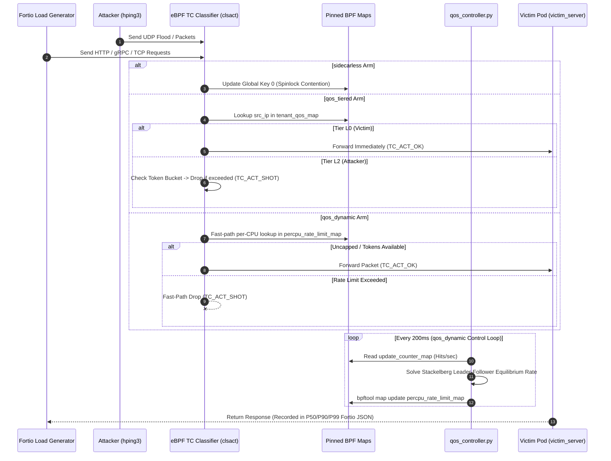

# Testbed QoS System Architecture Specification & Diagram

> **Document Goal**: This document provides a complete technical specification and Mermaid architecture diagram of the 4-Architecture QoS Testbed (`~/CLB/test_bed_qos/`).

---

## 1. System Architecture Diagram

---

## 2. Layer-by-Layer Architectural Breakdown

### Layer 1: Workload & Load Generation Layer
* **Fortio Load Generator**: Runs on CPU Core 0 using `fortio load`. Generates uniform benchmark traffic (50 QPS, 2 connections) targeting the Victim Pod IPs (`10.0.0.10`..`12`).
* **Attacker Load Generator**: Runs in `ns_attacker` (or pinned to background host cores 4–7) using `hping3` or `AdaptiveAttackerThread`. Generates UDP flood patterns (steady-state, bursty, ramping, or rational adaptive polling).

### Layer 2: Data Plane & Container Network Namespaces
* **Attacker Pod Namespace (`ns_attacker`)**: Isolated netns assigned IP `10.0.0.20/24`. Connects to host bridge `br-mesh` via `veth-attacker` <-> `veth-att-br`.
* **Victim Pod Namespaces (`ns_victim1`..`3`)**: Isolated netns assigned IPs `10.0.0.10/24`, `10.0.0.11/24`, `10.0.0.12/24`. Each container runs an OCI `runc` instance executing `victim_server.py` pinned to dedicated CPU cores (Cores 1, 2, 3).
* **Host Bridge (`br-mesh`)**: Linux bridge (`10.0.0.1/24`) connecting all container veth pairs.

### Layer 3: TC eBPF Subsystem & Evaluated Architectural Arms
Attached to the Traffic Control (`tc`) `clsact` hook on host veth interfaces:
1. **`sidecarless`**: Baseline eBPF router (`ebpf_mesh_router.c`) performing 50 map updates per packet targeting `shared_global_key = 0`. Forces cross-CPU spinlock contention on `htab_lock_bucket`.
2. **`sidecar`**: User-space proxy reference. TC eBPF filters are detached; `iptables` NAT PREROUTING redirects traffic to `socat` reverse proxy listening on port 8080 inside the victim netns.
3. **`qos_tiered`**: Alibaba Terway-style 3-tier static priority classifier (`ebpf_qos_tiered.c`). Uses `BPF_MAP_TYPE_HASH` keyed per source IP (`__u32 src_ip`). `TIER_L0` (victims) is uncapped, while `TIER_L1`/`TIER_L2` (attacker) is rate-capped via token buckets.
4. **`qos_dynamic`**: Fast-path dynamic rate limiter (`ebpf_qos_dynamic.c`). Uses `BPF_MAP_TYPE_PERCPU_HASH` sharded per CPU (Beeswax SIGCOMM '26 design) to eliminate cross-CPU lock stalls.

### Layer 4: Pinned BPF Filesystem Maps (`/sys/fs/bpf/tc/globals/`)
* **`update_counter_map`**: `BPF_MAP_TYPE_PERCPU_ARRAY` tracking total eBPF map update operations per second.
* **`lock_latency_hist`**: `BPF_MAP_TYPE_PERCPU_ARRAY` recording lock wait latency in log2 nanosecond buckets.
* **`percpu_rate_limit_map`**: `BPF_MAP_TYPE_PERCPU_HASH` storing per-tenant dynamic token-bucket rate limits and burst capacities.
* **`tenant_qos_map`**: `BPF_MAP_TYPE_HASH` storing static tier classifications and token bucket states for `qos_tiered`.

### Layer 5: Telemetry & Control Plane (Userspace)
* **Stackelberg QoS Controller (`qos_controller.py`)**: Runs a 200ms control loop polling `update_counter_map` via `bpftool`. Calculates the follower (attacker) Stackelberg rate cap $r^*(H) = \frac{r_{\max}}{1 + (H / H_{\text{threshold}})^\gamma}$ and updates `percpu_rate_limit_map`.
* **Telemetry Collectors**: `collect_ebpf_stats.py`, `collect_cgroup_stats.py`, and `collect_bpftrace_lock.bt` collect real-time latency histograms, CPU throttling, and kernel lock wait stats.
* **Matrix Runner & Plotter**: `run_multi_run_matrix.py` coordinates multi-repetition benchmark runs across all architectures and flood levels, outputting raw JSON/CSV data for `plot_multi_run_matrix.py`.

---

## 3. Data Flow & Execution Sequence

