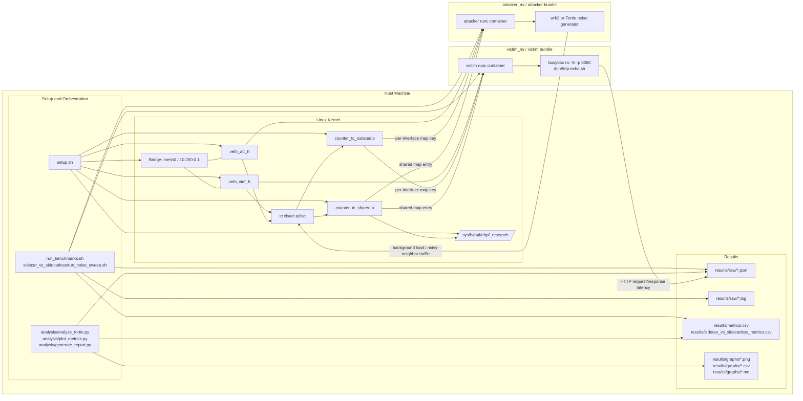
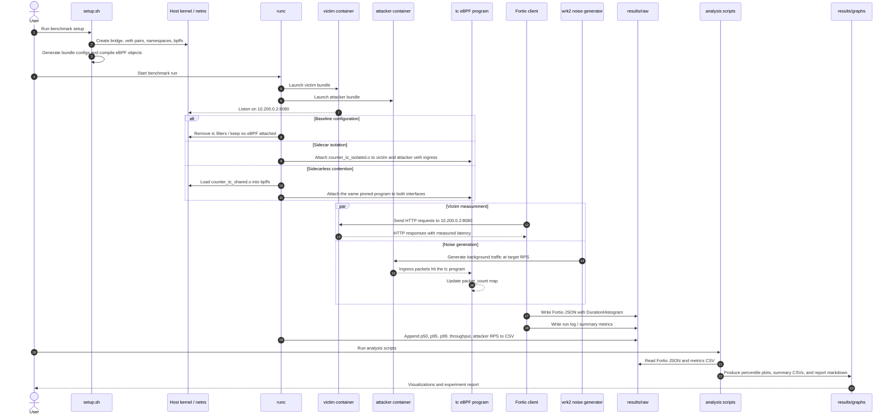
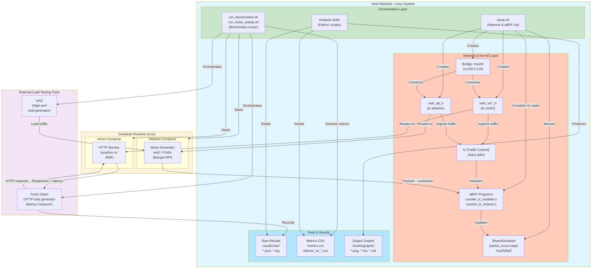

# eBPF Research Setup Diagrams

This document captures the benchmark architecture and the end-to-end execution flow used by the noisy-neighbor experiments.

## Architecture Diagram

## Sequence Diagram

## Component Diagram

## What This Setup Measures

The diagrams above represent a benchmark where:

- The victim container serves HTTP on port 8080.
- Fortio measures request latency against that victim endpoint.
- The attacker container generates background traffic to create contention.
- The tc eBPF program counts packets on ingress and creates either isolated or shared map contention.
- The scripts record raw Fortio JSON, extract percentile latency values, and generate plots and summary tables.
